### 命令概览：
0.1、linux命令概览  
```shell
cd /usr/local/dev/mongodb/bin #进入mongodb bin目录
ps -ef | grep mongod #查看mongodb进程号
netstat -anp | grep mongod #查看mongodb端口号
kill -9 pid #杀掉进程
```

0.2、mongdb命令概览  
```shell
./mongod -f mongodb.conf #通过配置文件启动mongodb服务
./mongod --shutdown -f mongodb.conf #通过配置文件关闭mongodb服务
./mongod --dbpath=/usr/local/dev/mongodb/data/db #通过指定参数启动mongodb服务
```

### 一、下载Redis：
1.1、官网查看Redis最新稳定版本：  
[Redis官网下载](https://redis.io/download)   
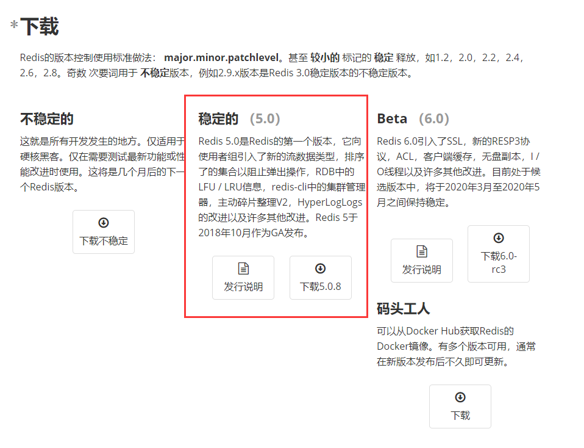  

1.2、下载解压Redis
```shell
#下载Redis
wget http://download.redis.io/releases/redis-5.0.8.tar.gz
# 解压文件
tar xzf redis-5.0.8.tar.gz
# 移动目录
mv redis-5.0.8 /home/prodUser/local/redis
#进入到redis，执行marke
cd /home/prodUser/local/redis
# make > https://www.cnblogs.com/zhoading/p/8523288.html
make
```
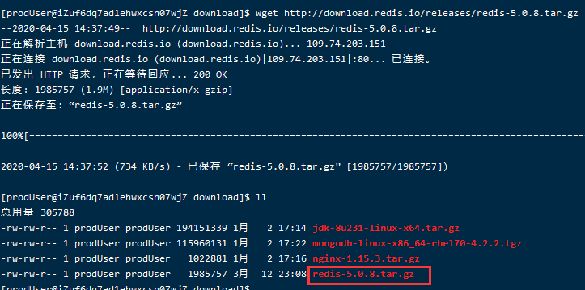  
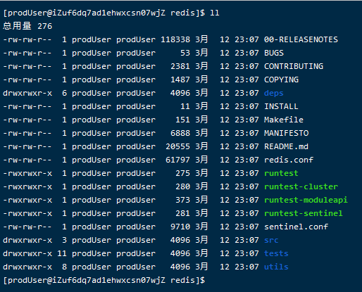  
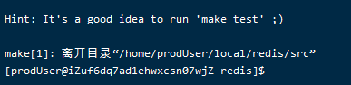  

### 二、启动Redis服务端：
2.1、修改redis.conf配置文件：
```shell
# 进入到redis目录
cd /home/prodUser/local/redis
# 修改文件
vim redis.conf
i
#修改启动方式为后台进程
daemonize yes
```
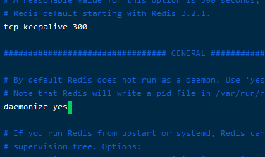  

2.2、启动Redis

```shell
#进入到src中
cd /home/prodUser/local/redis/src
#直接启动Redis
./redis-server
#使用redis.conf配置文件Redis
./redis-server ../redis.conf
```
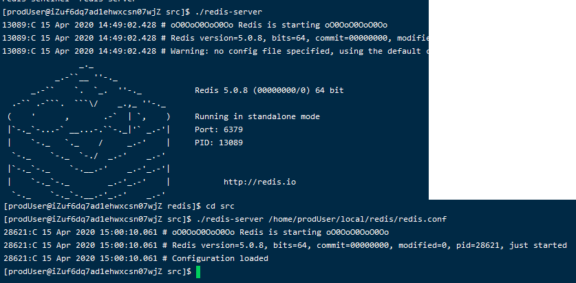

2.3、查看Redis启动状态：

```
# 查看redis启动进程
ps -ef | grep redis
```
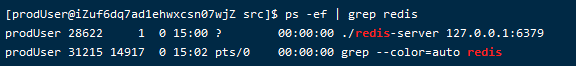

2.4、测试redis

```
#使用 redis-client客户端
cd /home/prodUser/local/redis/src
./redis-cli
# 连接服务端
ping
#添加String
set test helloword
#查找key
get test
```
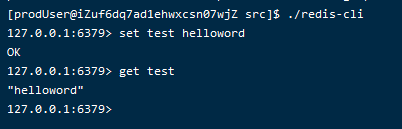

### 三、Redis安全配置：
3.1、修改redis.conf配置文件：

```
#打开保护模式
protected-mode yes
#更改默认启动端口，可不改，默认6379
port 12011
#设置redis启动密码
requirepass Woodu!Redis!654321
# 启动redis服务端
cd /home/prodUser/local/redis/src
./redis-server ../redis.conf
```
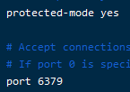

3.2、客户端连接授权

```
# 启动redis客户端
cd /home/prodUser/local/redis/src
./redis-cli
# 无授权访问
get hello
# 授权
auth Woodu!Redis!654321
```
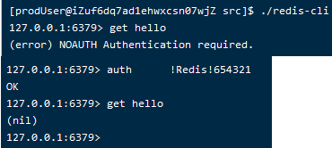


```
./redis-cli
# 检查redis是否设置了密码
CONFIG get requirepass
# 命令方式设置密码
CONFIG set requirepass "Woodu!Redis!654321"
```
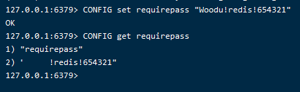  

### 四、Redis防火墙配置：
4.1、查看redis端口监听状态

```
#查看端口监听状态
netstat -ntlp
```
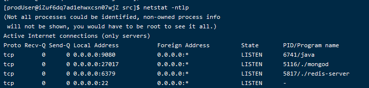  


4.2、修改redis.conf配置文件，开放外网访问权限

```
#指定redis只接收来自该IP的请求，如果不设置，那么将处理所有请求，
#在生产环节中最好设置该项(设置0.0.0.0 则改为用iptables来控制访问权限)
bind 0.0.0.0
```