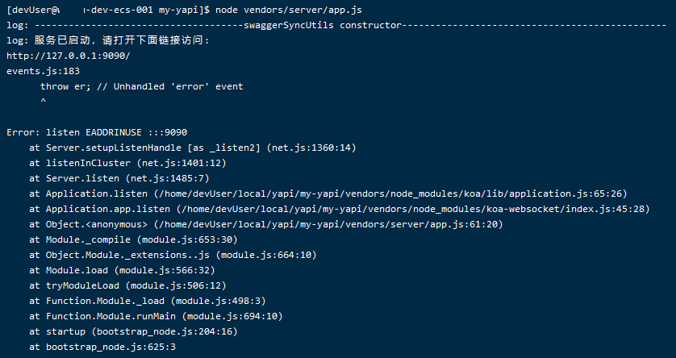
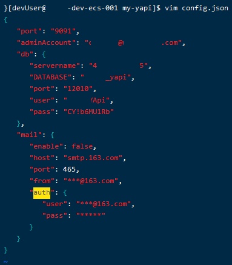
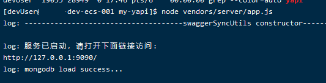

### 0 命令概览
0.1、Linux命令概览
```Shell
# 下载 YApi
npm install -g yapi-cli --registry https://registry.npm.taobao.org
```

### 1 Linux安装YApi
1.1、环境要求
- [x] Git
- [x] NodeJS (7.6+) 
- [x] MongoDB (2.6+)
```Shell
#查看Git版本
git --version
#查看NodeJS版本
node --version
#查看npm版本
npm -version
```

1.2、可视化部署[推荐]  
```
执行 yapi server 启动可视化部署程序，输入相应的配置和点击开始部署，就能完成整个网站的部署。  
部署完成之后，可按照提示信息，执行 node/{网站路径/server/app.js} 启动服务器。
在浏览器打开指定url, 点击登录输入您刚才设置的管理员邮箱，
默认密码(ymfe.org)登录系统（默认密码可在个人中心修改）。
```
```Shell
# 使用 npm下载，若无权限，可以使用 sudo提升权限
sudo npm install -g yapi-cli --registry https://registry.npm.taobao.org
# 启动yapi可视化部署界面
yapi server

# 启动yapi客户端
cd /home/devUser/local/yapi/my-yapi
node vendors/server/app.js

# 以后台进程启动客户端
nohup node /home/devUser/local/yapi/my-yapi/vendors/server/app.js 2>&1 &
```

  


1.2.2、进入到部署界面：
启动后显示的访问链接内网链接：http://0.0.0.0:9090  
可以通过外网IP访问，需要开通9090端口号：http://47.103.72.45:9090/  
  
  

1.2.3、若yapi客户端端口号配置和服务端端口号一致，会导致无法启动客户端  


可以通过 config.json中的 port 参数修改客户端端口号
```Shell
cd /home/devUser/local/yapi/my-yapi
vim config.json
port=9091
```


也可以关闭yapi server 释放端口号，
```Shell
ps -ef | grep yapi
kill -9 22379
```
未关闭时仍然可以访问可视化配置界面，但如果直接部署会提示
> 系统已安装，如需重新安装，请清空数据库和删除init.lock文件  

  
init.lock文件 位置：/home/devUser/local/yapi/my-yapi  
数据库则删除表即可

  
    


1.3、命令行部署
```Shell
# 命令行部署
git clone https://github.com/YMFE/yapi.git
```
