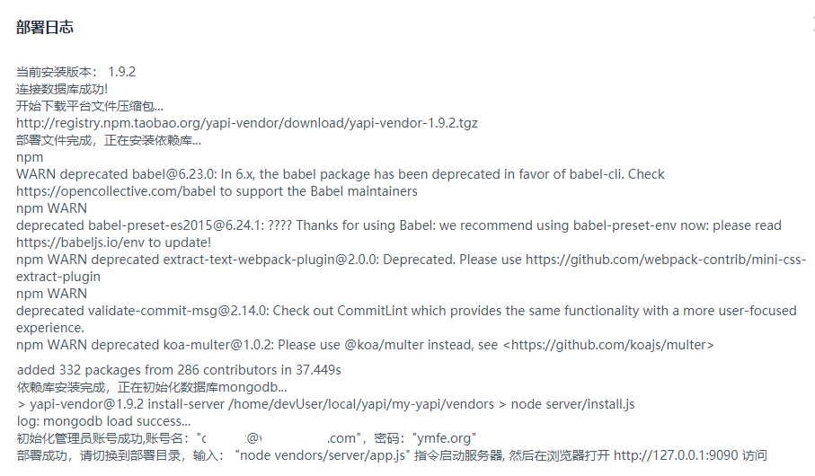

### 0 命令概览
0.1、命令概览
```shell
# 下载 YApi
npm install -g yapi-cli --registry https://registry.npm.taobao.org
# ps：以下命令应在yapi项目目录下，eg：/home/devUser/local/yapi/my-yapi
# 启动yapi可视化部署界面
yapi server
# 以后台进程启动客户端
nohup node /home/devUser/local/yapi/my-yapi/vendors/server/app.js &
# 查看yapi hellp
yapi --help
# 查看yapi版本号
yapi --version
# 查看版本号列表
yapi ls 
# 升级到指定版本，-v可选参数
yapi update -v v1.1.0 
```

### 1 Linux安装YApi
1.1、环境要求
- [x] Git
- [x] NodeJS (7.6+) 
- [x] MongoDB (2.6+)
- [ ] PM2（可选）
```shell
#查看Git版本
git --version
#查看NodeJS版本
node --version
#查看npm版本
npm -version
```

1.2、可视化部署[推荐]  
```
执行 yapi server 启动可视化部署程序，输入相应的配置和点击开始部署，就能完成整个网站的部署。  
部署完成之后，可按照提示信息，执行 node/{网站路径/server/app.js} 启动服务器。
在浏览器打开指定url, 点击登录输入您刚才设置的管理员邮箱，
默认密码(ymfe.org)登录系统（默认密码可在个人中心修改）。
```
```shell
# 使用 npm下载，若无权限，可以使用 sudo提升权限
sudo npm install -g yapi-cli --registry https://registry.npm.taobao.org
# 启动yapi可视化部署界面
yapi server

# 启动yapi客户端
cd /home/devUser/local/yapi/my-yapi
node vendors/server/app.js

# 以后台进程启动客户端
nohup node /home/devUser/local/yapi/my-yapi/vendors/server/app.js &
# 以下操作防止退出终端导致命令关闭
回车退出nohup提示信息
exit退出终端

cd /home/devUser/local/yapi/my-yapi/vendors/server
nohup npm start &
ps -ef | grep npm
```

  

1.2.2、进入到部署界面：
启动后显示的访问链接内网链接：http://0.0.0.0:9090  
可以通过外网IP访问，需要开通9090端口号：http://47.103.72.45:9090/  
  
  

1.2.3、若yapi客户端端口号配置和服务端端口号一致，会导致无法启动客户端  


可以通过 config.json中的 port 参数修改客户端端口号
```shell
cd /home/devUser/local/yapi/my-yapi
vim config.json
port=9091
```


也可以关闭yapi server 释放端口号，
```shell
ps -ef | grep yapi
kill -9 22379
```
未关闭时仍然可以访问可视化配置界面，但如果直接部署会提示
> 系统已安装，如需重新安装，请清空数据库和删除init.lock文件  

  
- init.lock文件 位置：安装路径/yapi/my-yapi/init.lock
    - eg：/home/devUser/local/yapi/my-yapi/config.json  
- 数据库则删除表即可

  
    


1.3、命令行部署
```shell
mkdir yapi
cd yapi
# 从git上下载yapi 或者下载 zip 包解压到 vendors 目录（clone 整个仓库大概 140+ M，可以通过 `git clone --depth=1 https://github.com/YMFE/yapi.git vendors` 命令减少，大概 10+ M）
git clone https://github.com/YMFE/yapi.git vendors 
//复制完成后请修改相关配置
cp vendors/config_example.json ./config.json 

cd vendors
npm install --production --registry https://registry.npm.taobao.org
npm run install-server //安装程序会初始化数据库索引和管理员账号，管理员账号名可在 config.json 配置
node server/app.js //启动服务器后，请访问 127.0.0.1:{config.json配置的端口}，初次运行会有个编译的过程
```

### 2 YApi升级

```shell
cd  /home/devUser/local/yapi/my-yapi
# 查看yapi版本号
yapi --version
# 查看版本号列表
yapi ls 
# 升级到最新版本
yapi update 
# 升级到指定版本
yapi update -v v1.1.0 
```

### 3 YApi配置
> config.json索引：安装路径/yapi/my-yapi/config.json，eg：/home/devUser/local/yapi/my-yapi/config.json


3.1、禁止注册
在 config.json 添加 closeRegister:true 配置项,就可以禁止用户注册 yapi 平台，修改完成后，请重启 yapi 服务器。

```
{
  "port": "9090",
  "closeRegister":true
}
```

3.2 配置邮箱  
新增 mail 配置， 替换默认的邮箱配置
```
{
  "port": "*****",
  "mail": {
    "enable": true,
    "host": "smtp.163.com",    #邮箱服务器
    "port": 465,               #端口
    "from": "***@163.com",     #发送人邮箱
    "auth": {
        "user": "***@163.com", #邮箱服务器账号
        "pass": "*****"        #邮箱服务器密码
    }
  }
}
```
以企业邮箱为例：
```
{
  "port": "9090",
  "mail": {
    "enable": true,
    "host": "smtp.exmail.qq.com",  
    "port": 465,            
    "from": "*****@*****.com",
    "auth": {
        "user": "*****@*****.com",
        "pass": "*****"
    }
  }
}
```

3.3、版本通知  
（v1.3.19+ 增加）在 config.json 添加 "versionNotify": true 配置项，就可以开启版本通知功能，默认为 false，修改完成后，请重启 yapi 服务器。

```
{
  "port": "******",
  "versionNotify": true
}
```

3.4、配置mongodb集群  
1.4.0以上版本，然后在 config.json db项，配置 connectString、

```
{
  "port": "***",
  "db": {
    "connectString": "mongodb://127.0.0.100:8418,127.0.0.101:8418,127.0.0.102:8418/yapidb?slaveOk=true",
    "user": "******",
    "pass": "******"
  },
}
```

3.5、配置LDAP登录
> [轻型目录访问协议（Lightweight Directory Access Protocol，LDAP）](https://baike.baidu.com/item/%E8%BD%BB%E5%9E%8B%E7%9B%AE%E5%BD%95%E8%AE%BF%E9%97%AE%E5%8D%8F%E8%AE%AE?fromtitle=LDAP&fromid=2875565) 是一个开放的，中立的，工业标准的应用协议，通过IP协议提供访问控制和维护分布式信息的目录信息。

```
{
  "port": "*****",
  "adminAccount": "********",
  "db": {...},
  "mail": {...},
  "ldapLogin": {
      "enable": true,
      "server": "ldap://l-ldapt1.com",
      "baseDn": "CN=Admin,CN=Users,DC=test,DC=com",
      "bindPassword": "password123",
      "searchDn": "OU=UserContainer,DC=test,DC=com",
      "searchStandard": "mail",    // 自定义格式： "searchStandard": "&(objectClass=user)(cn=%s)"
      "emailPostfix": "@163.com",
      "emailKey": "mail",
      "usernameKey": "name"
   }
}
```
配置项含义如下：
- enable 表示是否配置 LDAP 登录，true(支持 LDAP登录 )/false(不支持LDAP登录);
- server LDAP 服务器地址，前面需要加上 ldap:// 前缀，也可以是 ldaps:// 表示是通过 SSL 连接;
- baseDn LDAP 服务器的登录用户名，必须是从根结点到用户节点的全路径(非必须);
- bindPassword 登录该 LDAP 服务器的密码(非必须);
- searchDn 查询用户数据的路径，类似数据库中的一张表的地址，注意这里也必须是全路径;
- searchStandard 查询条件，这里是 mail 表示查询用户信息是通过邮箱信息来查询的。
    - 注意，该字段信息与LDAP数据库存储数据的字段相对应，如果如果存储用户邮箱信息的字段是 email, 这里就需要修改成 email.（1.3.18+支持）自定义filter表达式，基本形式为：&(objectClass=user)(cn=%s), 其中%s会被username替换
- emailPostfix 登陆邮箱后缀（非必须）
- emailKey: ldap数据库存放邮箱信息的字段（v1.3.21 新增 非必须）
- usernameKey: ldap数据库存放用户名信息的字段（v1.3.21 新增 非必须）