### 1 插件准备
1.1、插件要求
- [x] [extended-choice-parameter](https://plugins.jenkins.io/extended-choice-parameter/)

1.2、安装插件
> 索引：Manage Plus(插件管理) > 可选插件 > 过滤 >  Extended Choice Parameter

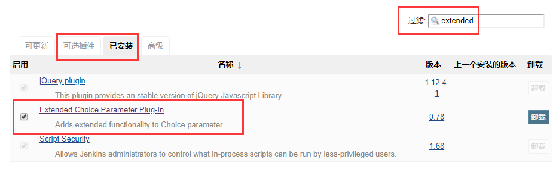

### 2 参数化配置

2.1.1 扩展参数配置：
> 索引：General > This project is parameterized > Extended Choice Parameter

Extended Choice Parameter 参数基本信息配置（必填）：  
- Name：参数名称，即后续操作使用的key
- Description：参数描述信息
- Basic Parameter Types：设置参数基本信息
    - Parameter Type：参数选择类型：单选框，多选框，单选按钮，多选按钮等
    - Number of Visible Items：参数可见数量
    - Delimiter：参数分隔符号
    - Quote Value：引用值
    
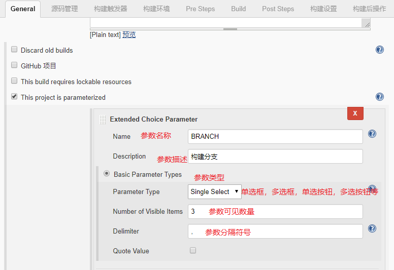  

Choose Source for Value 设置参数值信息（必填，单选）：  
- Value：使用默认值，设置参数可选列表
    - Value：参数可选列表
- Property File：使用参数文件，设置参数可选列表
    - 属性文件是键、值对的集合，形式为key=value1,value2，属性文件可以放在文件系统中Jenkins可以访问的任何位置。
    - Property Key：要使用的属性文件名称。例如，如果属性文件如下: prop1 = a, b, c, d, e prop2 = 1, 2, 3, 4 然后可以将属性指定为prop1或prop2。
- Groovy Script：Groovy脚本
- Groovy Script File：Groovy脚本文件地址

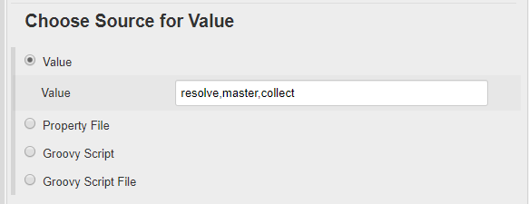  

Choose Source for Default Value 设置参数默认值（必填，单选）：
- Default Value 设置参数默认值
- Default Property File 参数文件
- Default Groovy Script Groovy脚本
- Default Groovy Script File Groovy脚本文件地址

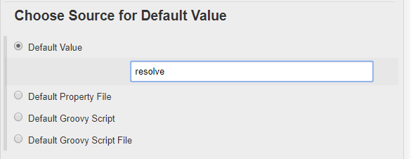  

 Choose Source for Value Description 设置参数描述信息（选填，单选）：
 - Description 描述信息
 - Description Property File 参数文件
 - Description Groovy Script Groovy脚本
 - Description Groovy Script File Groovy脚本文件地址
 - Multi-level Parameter Types 多层次的参数类型
 - JSON Parameter Type JSON参数类型

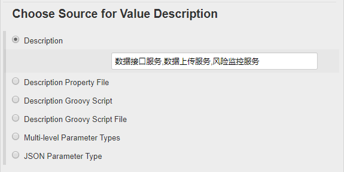  

### 3 源码管理
- Repositories 资源信息设置（必填）
    - Repository URL git URL地址  
    - Credentials 选择配置好的权限账号（在凭据中提前配置）
- Branches to build：构建分支设置
    - 指定分支（为空时代表any）：可以引用设置的参数${参数名称}
- 源码库浏览器：源码库浏览设置（选填）：选择源码库类型，如githubweb、gitblit、gitlab...
    -  GitBlit root url：项目地址
    -  	Project name in GitBlit：项目名称

在 Branches to build > 	指定分支 中可以引用上面设置的分支参数，作为构建信息
```
*/${BRANCH}
```

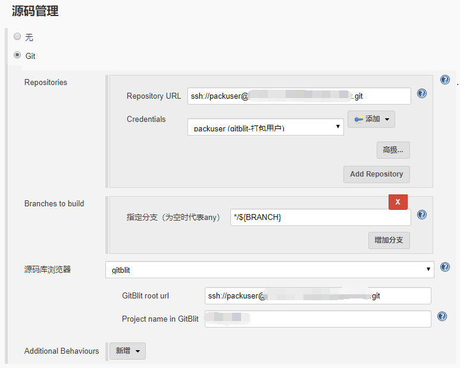

### 4 Pre Steps(构建前执行动作)
4.1、Execute shell script on remote host using ssh(在远程主机上使用ssh执行shell脚本) 

- SSH site：SSH远程主机选择，在系统配置中SSH remote hosts预先配置  
    - SSH Site配置方式
    - > 索引：Manage Jenkins > Configure System > SSH remote hosts  
    
    - [x] 插件要求：[publish over ssh](https://plugins.jenkins.io/publish-over-ssh/)  
    - SSH remote hosts(SSH远程主机设置)：  
        - Hostname：主机IP地址
        - Port：主机端口
        - Credentials：主机访问权限
        - Pty：伪终端选项
        - serverAliveInterval：服务器访问心跳时间间隔
        - timeout：链接超时时间
    - 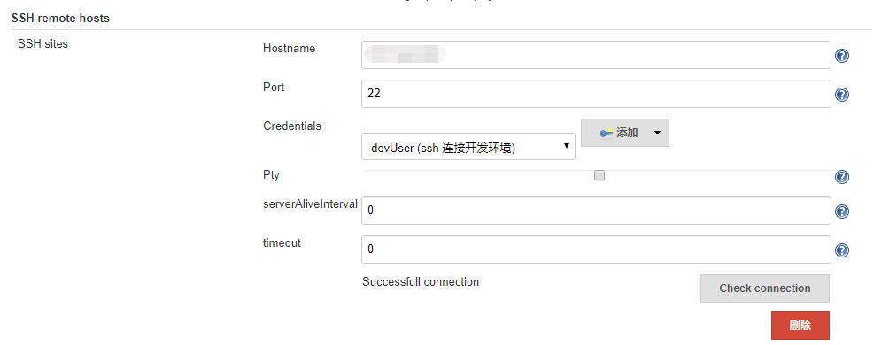  

- Command：执行命令
- Execute each line：执行每一行选项
- Hide command from console output：从控制台输出隐藏命令
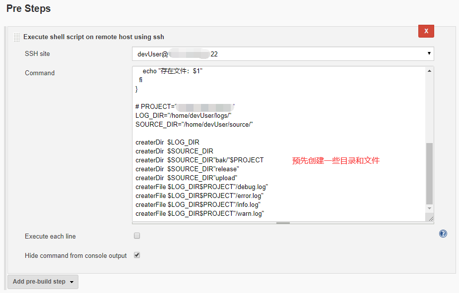  

### 5 Build(构建)
使用Maven构建项目的设置
- Root POM：Maven构建的根节点pom.xml的(相对)路径
- Goals and options：Maven构建参数，具体信息参考Maven

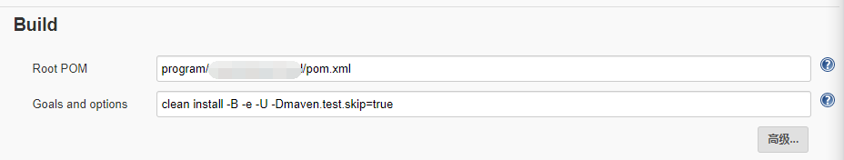  

### 6 Post Steps(构建后执行动作)
设置动作运行状态
- Run only if build succeeds：仅在构建成功时运行
- Run only if build succeeds or is unstable ：仅在构建成功或不稳定时运行
- Run regardless of build result：不管构建结果如何运行
-
6.1、Send files or execute commands over SSH(通过SSH发送文件或执行命令)  
> SSH Publishers：SSH发布设置(可以发送到多个服务器)：  

6.1.1、 SSH Server：设置SHH发布远程主机
- Name：选择发布到的远程主机，在系统参数中SSH Servers中预先设置  

SSH Servers配置方式：  
- > 索引：Manage Jenkins > Configure System > SSH Servers 

- [x] 插件要求：[publish over ssh](https://plugins.jenkins.io/publish-over-ssh/)  
- SSH Server(SSH远程服务主机设置)：  
- Name：设置服务名称
- Hostname：主机IP地址
- Username：登录账号
- Remote Director：访问目录
- Port：端口号
- Timeout (ms)：链接超时时间（毫秒数） 
- Proxy password：登录密码
- 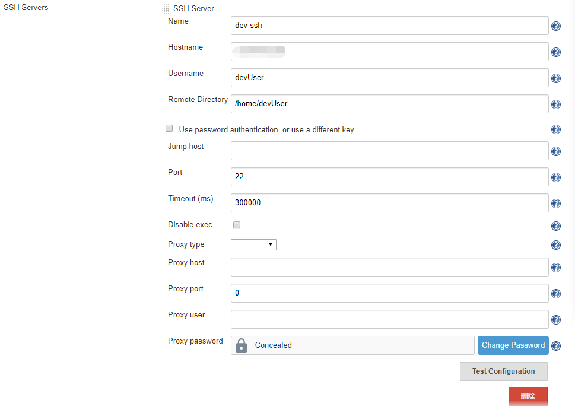  

6.1.2、Transfers：远程传输设置（可以设置多个）  
- Transfer Set：具体传输设置 
    - Source files：源文件（jenkins项目的相对路径）
    - Remove prefix：不传输的目录
    - Remote directory：传输到主机路径，实际传输目录：访问目录/传输目录
    - Exec command：执行命令

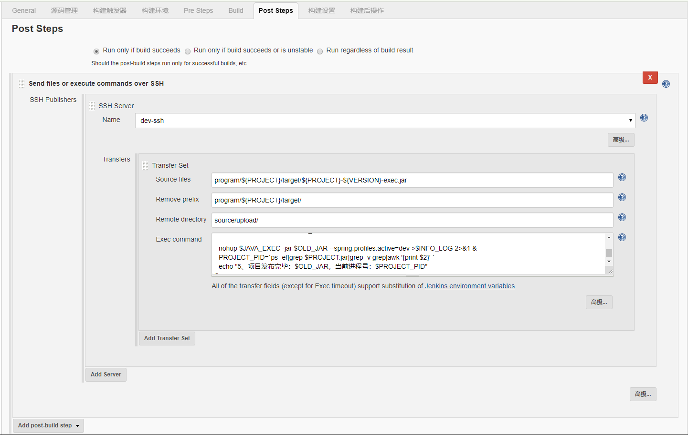  


### 7 发布脚本及其发布过程
7.1、Pre Steps(构建前执行动作)：
```shell
# Command
#!/bin/bash
echo "构建参数信息：构建分支:${BRANCH}，构建项目: ${PROJECT}，构建版本：${VERSION}"

function createrDir(){
  if [[ ! -d $1 ]];
  then
    mkdir -p $1
    echo "创建目录：$1"
  else
    echo "存在目录：$1"
  fi
}
function createrFile(){
  createrDir ${1%/*}
  if [[ ! -f $1 ]];
  then
    touch $1
    echo "创建文件：$1"
  else
    echo "存在文件：$1"
  fi
}

# PROJECT=${PROJECT}
LOG_DIR="/home/devUser/logs/"
SOURCE_DIR="/home/devUser/source/"

createrDir  $LOG_DIR
createrDir  $SOURCE_DIR
createrDir  $SOURCE_DIR"bak/"$PROJECT
createrDir  $SOURCE_DIR"release"
createrDir  $SOURCE_DIR"upload"
createrFile $LOG_DIR$PROJECT"/debug.log"
createrFile $LOG_DIR$PROJECT"/error.log"
createrFile $LOG_DIR$PROJECT"/info.log"
createrFile $LOG_DIR$PROJECT"/warn.log"
```

7.2、Build(构建)：
```properties
# Root POM
program/woodu-data-cloud/pom.xml
# Goals and options
clean install -B -e -U -Dmaven.test.skip=true
```

7.3、Post Steps(构建后执行动作)：
```properties
# Source files
program/${PROJECT}/target/${PROJECT}-${VERSION}-exec.jar
# Remove prefix
program/${PROJECT}/target/
# Remote directory
source/upload/
```
```shell
# Exec command：
#!/bin/bash

#PROJECT=${PROJECT}
LOG_DIR="/home/devUser/logs/"
SOURCE_DIR="/home/devUser/source/"
INFO_LOG=$LOG_DIR$PROJECT"/info.log"
JAVA_EXEC=/home/devUser/soft/java/jre/bin/java
  
echo "1、检测是否上传完毕项目"
UPLOAD_JAR=$SOURCE_DIR"upload/"$PROJECT"-$VERSION-exec.jar"
if [[ ! -f $UPLOAD_JAR ]];
then
  echo "jenkins通过SSH上传到即待发布目录失败：$UPLOAD_JAR"
  echo "项目发布失败：$UPLOAD_JAR"
  echo "error-Jenkins发布警告！标识：项目构建成功、【上传失败】停止执行发布命令"
  exit  
else
  echo "2、开始项目备份"
  OLD_JAR=$SOURCE_DIR"release/"$PROJECT".jar"
  if [[ ! -f $OLD_JAR ]];
  then
    echo "没有要备份的项目：$OLD_JAR"
  else
    BAK_JAR=$SOURCE_DIR"bak/"$PROJECT"/"$PROJECT"-"`date +%Y-%m-%d-%H%M%S`".jar"
    cp $OLD_JAR $BAK_JAR
    echo "项目备份完成：$BAK_JAR"
    
    rm -rf $OLD_JAR
    echo "删除历史项目：$OLD_JAR"
  fi

  echo "3、开始关闭项目"
  PROJECT_PID=`ps -ef|grep $PROJECT.jar|grep -v grep|awk '{print $2}' `
  if [[ -n $PROJECT_PID ]];
  then
    kill -9 $PROJECT_PID
    echo "关闭$PROJECT项目进程：$PROJECT_PID"
  else
    echo "项目$PROJECT没有启动，无需关闭"
  fi
    
  echo "4、开始项目发布"
  cp $UPLOAD_JAR $OLD_JAR
  echo "新项目拷贝完毕：$OLD_JAR"

  PROJECT_PID=`ps -ef|grep $PROJECT.jar|grep -v grep|awk '{print $2}' `
  echo "5、项目发布完毕：$OLD_JAR，当前进程号：$PROJECT_PID"
fi
```

  
